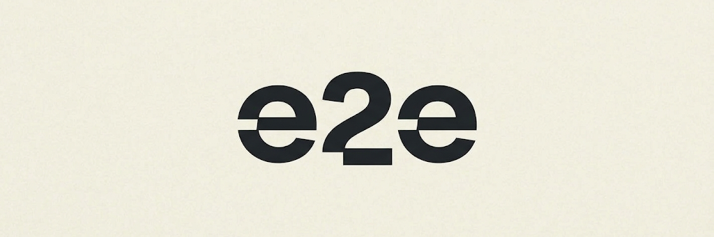

# e2e + KERNEL

Run agentic end-to-end tests against any publicly reachable documentation site
in a hosted browser with [e2e](https://e2e.tester.army/docs) and KERNEL.
e2e is a test framework that combines natural-language agent steps like
`agent.act` and `agent.assert` with deterministic locator assertions, and
replays verified agent steps without model calls until the app changes.
See the [KERNEL integration guide](https://e2e.tester.army/docs/integrations/kernel)
for provider options and recording behavior.

The included example targets the [KERNEL documentation](https://www.kernel.sh/docs).
Replace the URL, paths, and assertions in the test file to use another
documentation site.

## Prerequisites

- Node.js 22.12 or newer
- a [KERNEL API key](https://dashboard.onkernel.com/sign-in)
- an [OpenAI API key](https://platform.openai.com/api-keys)

## Setup

```bash
cp .env.example .env
npm install
npm test
```

Set `KERNEL_API_KEY` and `OPENAI_API_KEY` in `.env`. `DOCS_URL` defaults to
`https://www.kernel.sh`. The tests use paths and assertions specific to the
KERNEL docs, so to test another site, change `DOCS_URL` and update the tests in
`tests/smoke.e2e.ts` to match. The browser runs headful by default so you can
watch the test in the KERNEL live view. To run it headless, add
`headless: true` to the browser configuration in `e2e.config.ts`:

```ts
browser: kernel({
  headless: true,
  stealth: true,
  viewport: { width: 1920, height: 1080 },
}),
```

KERNEL replays require a headful browser, so headless runs record the web
screencast instead.

## Extend the test

Edit `tests/smoke.e2e.ts` to change the docs paths and add your own agent
actions, agent assertions, structured extraction, and locator assertions. Update
`DOCS_URL` when testing another site.

The KERNEL browser provider leases one browser per worker by default and
releases it when the run finishes.

## Record replays

The target records a KERNEL replay when a test fails. The first test also
records a replay on every run with its `{ video: "on" }` option. Replays are
saved as `video/replay.mp4` in each test attempt's folder under
`.e2e/artifacts/`. To use the web screencast instead, set `replay: false` in the
KERNEL browser configuration.
